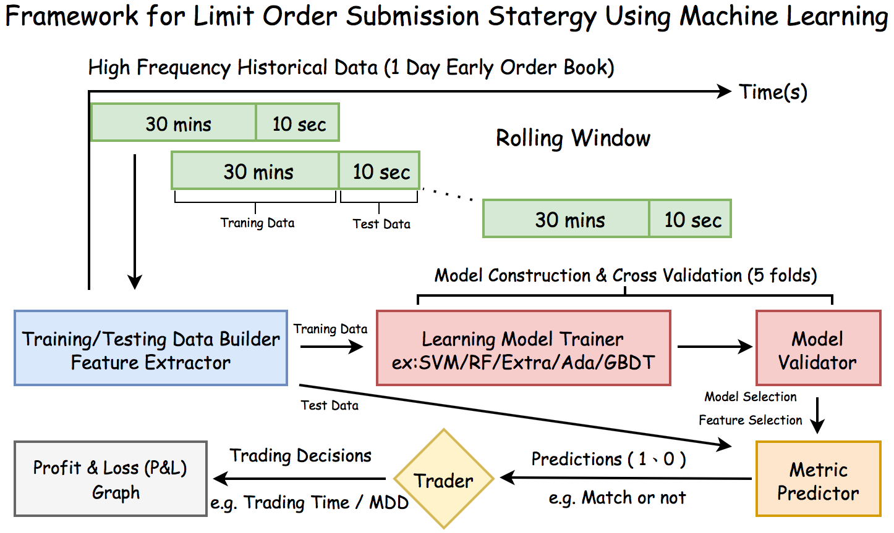
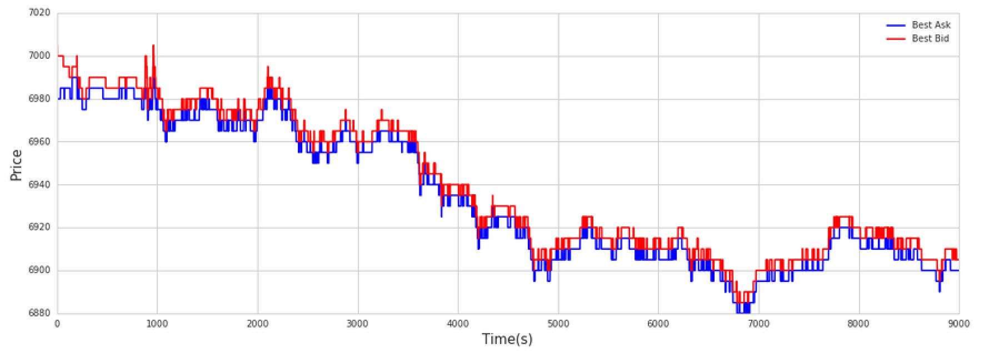
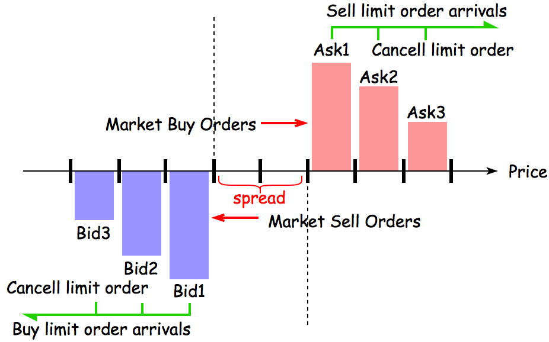
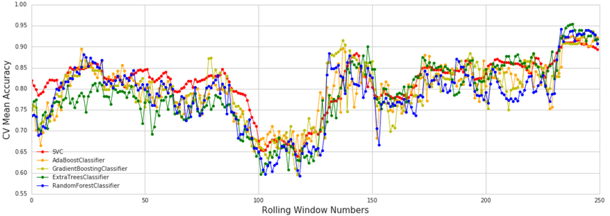
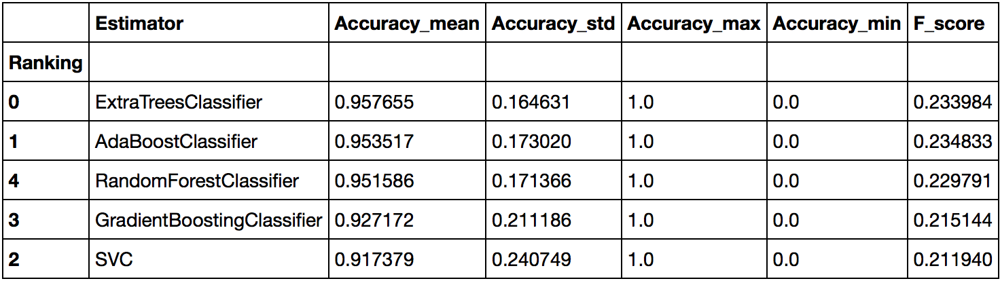
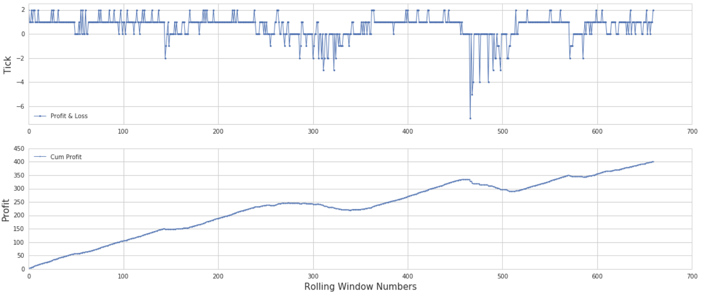

## Modeling High-Frequency Limit Order Book Dynamics Using Machine Learning 

* Framework to capture the dynamics of high-frequency limit order books.

  
  
#### Overview

In this project I used machine learning methods to capture the high-frequency limit order book dynamics and simple trading strategy to get the P&L outcomes.

* Feature Extractor

  * Rise Ratio
  
    

  * Depth Ratio
  
    
    
    [Note] : [Feature_Selection] (Feature_Selection) 
 
* Learning Model Trainer
  
  *  RandomForestClassifier
  *  ExtraTreesClassifier
  *  AdaBoostClassifier
  *  GradientBoostingClassifier
  *  SVM
  
*  Use best model to predict next 10 seconds

   
   
*  Prediction outcome

   
   
*  Profit & Loss

   
   
   [Note] : [Model_Selection] (Model_Selection) 

 

